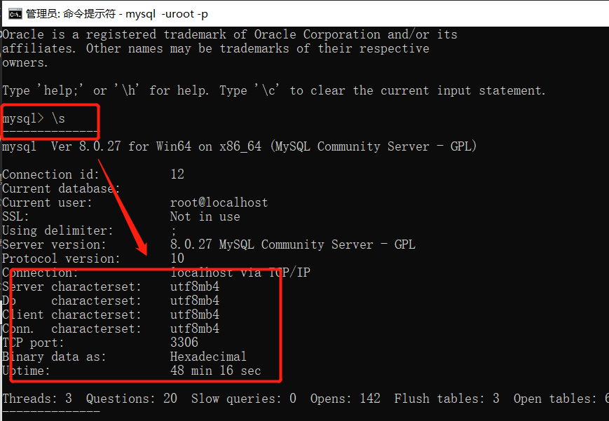

# Windows 系统中安装 MySQL8.0 及配置方法

**一、下载 zip 地址**

https://dev.mysql.com/downloads/mysql/8.0.html


**二、解压到本地，添加/bin 目录到环境变量**

**三、初始化 MySQL 数据库**

进入到目录：


执行安装的命令，并设置默认 root 密码为空，如下：

```bash
mysqld --initialize-insecure
```

初始化完成后，在 mysql 根目录中会自动生成 data 文件夹。

**四、为 Windows 系统安装 MySQL 服务**

执行命令：

```bash
mysqld install MySQL_8.0
```


安装成功后，可以在服务中，看到安装好的 MySQL8 的服务。


**五、启动服务后，需要设置 MySQL 的登录密码**

> 首次安装第一次进入，root 默认没有密码，直接执行`mysql -uroot -p`进入

使用命令

```bash
use mysql;
alter user 'root'@'localhost' identified by '123456';
flush privileges;
```

注意：这点同 5.7 版本的安装方法

退出后，使用您的新密码登录，如果成功，则证明更改正确。

```bash
mysql -uroot -p
```

**六、此时，本地使用 Navicat。还需要进行设置。**

进入 mysql 之后，执行命令：

```bash
ALTER USER root@localhost IDENTIFIED WITH mysql_native_password BY '123456';
flush privileges;
```

退出后，再使用 Navicat 链接，如果看到下图，恭喜您，成功啦。


七、对于 my.ini 文件的配置

**在安装的根目录下，需要手动添加 my.ini 文件**，如下图：


文件内容，大致如下，有特殊需要，请自行配置：

```yaml
[mysqld]
# 设置3306端口
port=3306
# 允许最大连接数
max_connections=200
# 允许连接失败的次数。这是为了防止有人从该主机试图攻击数据库系统
max_connect_errors=10
# 服务端使用的字符集默认为UTF8
character-set-server=utf8mb4
# 创建新表时将使用的默认存储引擎
default-storage-engine=INNODB
# 默认使用“mysql_native_password”插件认证
default_authentication_plugin=mysql_native_password
# 关闭ssl
skip_ssl
# 配置时区
default-time_zone='+8:00'
# 配置相关参数
sql_mode=STRICT_TRANS_TABLES,NO_ZERO_IN_DATE,NO_ZERO_DATE,ERROR_FOR_DIVISION_BY_ZERO,NO_ENGINE_SUBSTITUTION
[mysql]
# 设置mysql客户端默认字符集
default-character-set=utf8mb4
[client]
# 设置mysql客户端连接服务端时默认使用的端口
port=3306
default-character-set=utf8mb4
```

重新启动服务后，在命令中，可以看到生效后的效果，如下图：



客户端的编码方式，默认是 GBK，现在已经更改为了 utf8mb4。

# 以 root 用户远程连接 MySQL8.0 问题总结

```

# 使用root用户登录mysql数据库，进入到mysql数据库
mysql -u root -p


# 切换到mysql数据库
use mysql;

# 查看user表的host和user数据：会发现root用户允许的host是localhost
select host, user from user;

# 修改数据：把user为root的host改为%，表示允许root用户在所有IP上登录
update user set host='%' where user='root';


# 重启mysql：
/etc/init.d/mysql restart
```
